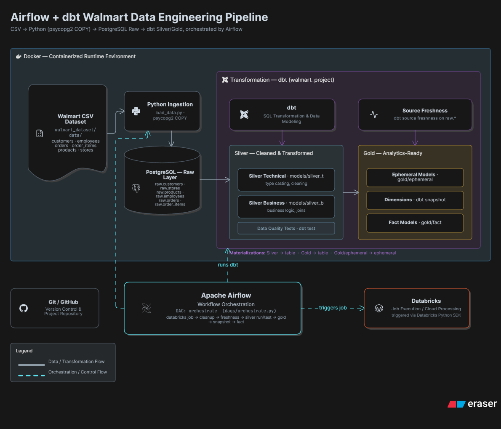
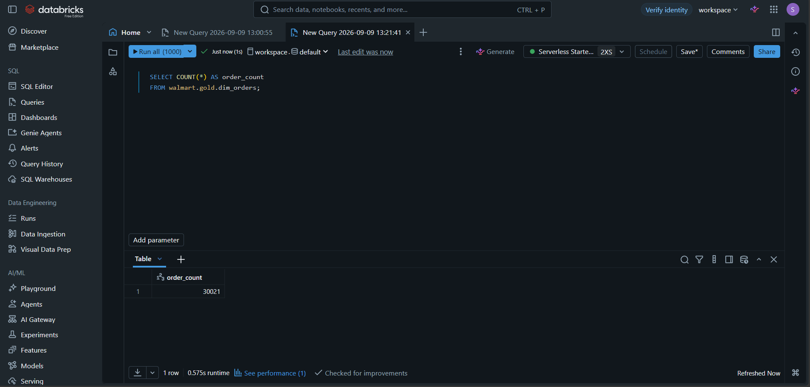
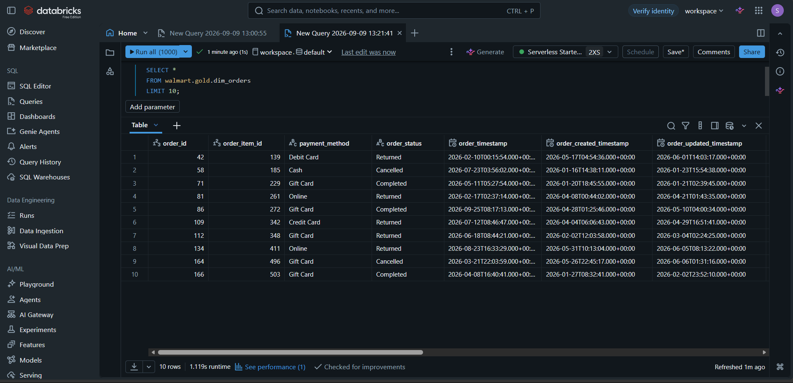
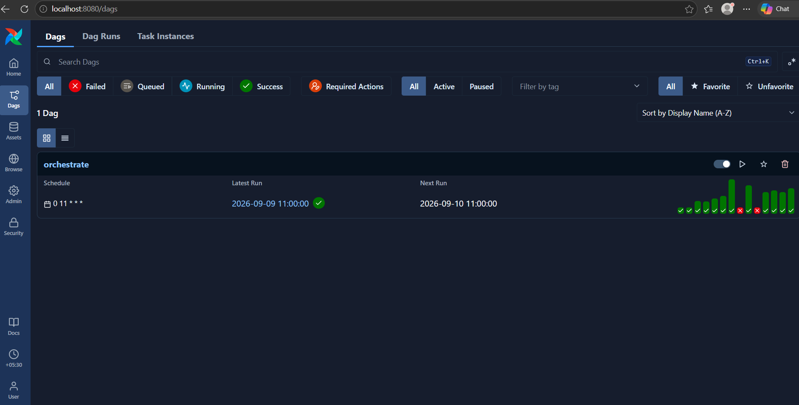
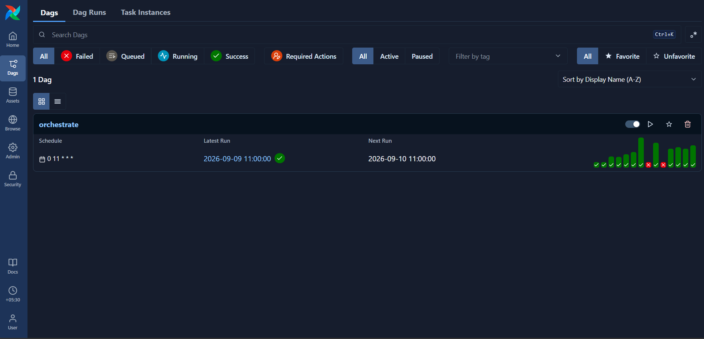
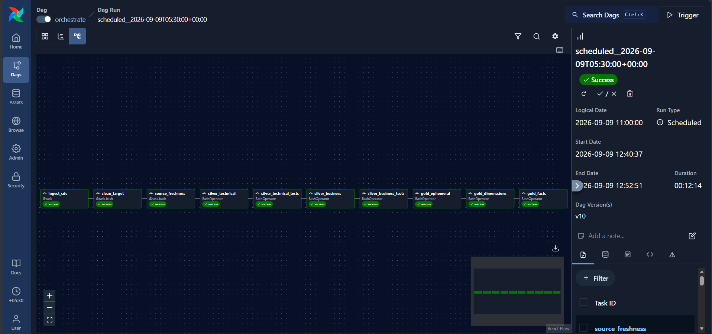
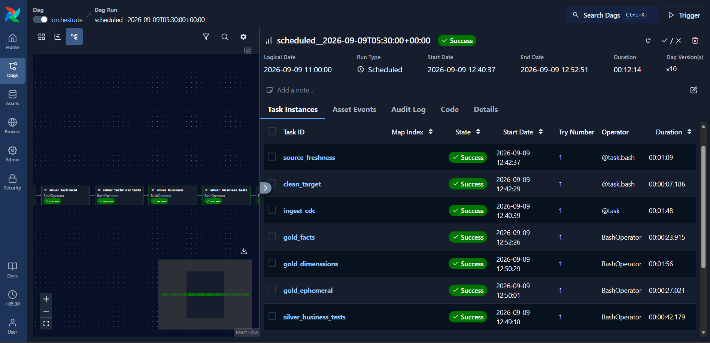

# Walmart Data Engineering Pipeline — Airflow + dbt + Databricks

[](https://airflow.apache.org/)
[](https://www.getdbt.com/)
[](https://www.databricks.com/)
[](https://www.docker.com/)
[](https://www.python.org/)


An end-to-end Walmart data engineering pipeline using **Python, PostgreSQL, Apache Airflow, dbt, Databricks, and Docker** for data loading, workflow orchestration, transformation, testing, historical tracking, and analytics-ready modeling.

---

## 🚀 Project Overview

This project demonstrates an end-to-end data engineering workflow using:

* **Python + PostgreSQL** for Walmart dataset loading
* **Apache Airflow** for workflow orchestration and scheduling
* **Databricks** for the configured data-processing job
* **dbt** for SQL transformations, testing, source freshness, snapshots, and modeling
* **Docker & Docker Compose** for the Airflow environment
* **Redis + CeleryExecutor** for Airflow task execution
* **Git & GitHub** for version control

The pipeline follows a layered transformation approach from source data through technical and business transformations into curated Gold models.

> **Implementation Note:** PostgreSQL source data is ingested into the `walmart.bronze` layer through a configured Databricks ingestion job. The Airflow `ingest_cdc` task triggers and monitors the Databricks job using the Databricks SDK.

---

## 🏗️ Architecture

The project combines data loading, Databricks processing, Airflow orchestration, and dbt transformations.

### High-Level Architecture


### Architecture Details



> **Architecture Note:** Apache Airflow is the workflow orchestration and control layer. It triggers and monitors the configured Databricks job and coordinates the dbt workflow. Airflow is not represented as the data-storage or transformation engine.

---
## 🔄 Pipeline Workflow

| Stage                        | Technology          | Purpose                                                                   |
| ---------------------------- | ------------------- | ------------------------------------------------------------------------- |
| **Data Loading**             | Python + PostgreSQL | Load Walmart CSV files into PostgreSQL tables used by the project         |
| **Orchestration**            | Apache Airflow      | Control task execution, dependencies, and scheduling                      |
| **Processing Job**           | Databricks          | Trigger and monitor the configured Databricks job                         |
| **Source Validation**        | dbt                 | Check source freshness                                                    |
| **Silver Technical**         | dbt                 | Perform technical transformations                                         |
| **Silver Testing**           | dbt                 | Validate technical models                                                 |
| **Silver Business**          | dbt                 | Create business-oriented transformations                                  |
| **Business Testing**         | dbt                 | Validate business models                                                  |
| **Gold Intermediate Models** | dbt                 | Compile reusable ephemeral SQL transformations for downstream Gold models |
| **Snapshots**                | dbt                 | Track historical changes for dimension models                             |
| **Gold Fact**                | dbt                 | Create the final analytics-ready fact model                               |

The actual Airflow task dependency chain is:

```text
ingest_cdc
    ↓
clean_target
    ↓
source_freshness
    ↓
silver_technical
    ↓
silver_technical_tests
    ↓
silver_business
    ↓
silver_business_tests
    ↓
gold_ephemeral
    ↓
gold_dimenssions
    ↓
gold_facts
```

> **Implementation note:** `ingest_cdc` is the Airflow task name used to trigger and monitor the configured Databricks job; it does not represent a standalone CDC platform. `gold_dimenssions` is retained exactly as implemented in the current DAG, including its spelling.

---

## 📊 Source Dataset

The project uses six Walmart CSV datasets:

| Dataset           | Description             |
| ----------------- | ----------------------- |
| `customers.csv`   | Customer information    |
| `employees.csv`   | Employee information    |
| `order_items.csv` | Individual order items  |
| `orders.csv`      | Order-level information |
| `products.csv`    | Product information     |
| `stores.csv`      | Store information       |

### Dataset Loading

The Python loader is located at:

```text
walmart_dataset/load_data.py
```

It maps the CSV files to the PostgreSQL raw schema:

```text
customers.csv    → raw.customers
stores.csv       → raw.stores
products.csv     → raw.products
employees.csv    → raw.employees
orders.csv       → raw.orders
order_items.csv  → raw.order_items
```

The loader uses PostgreSQL `COPY` operations for bulk loading and performs transaction rollback if an error occurs.

---

## 🧩 dbt Transformation Architecture

The dbt project is located in:

```text
walmart_project/
```

The transformation layers are organized into:

```text
models/
├── source/
├── silver_t/
├── silver_b/
└── gold/
```

### Source Layer

The dbt source configuration defines the Databricks Bronze source:

```text
walmart.bronze
```

The configured source tables are:

* `orders`
* `customers`
* `products`
* `order_items`
* `stores`
* `employees`

### Silver Technical Layer

The **Silver Technical** layer performs technical transformations and standardization on the source data.

Airflow executes:

```bash
dbt run --select silver_t
```

Technical models are then validated with:

```bash
dbt test --select silver_t
```

### Silver Business Layer

The **Silver Business** layer combines the technically transformed data into business-oriented models.

Airflow executes:

```bash
dbt run --select silver_b
```

Business models are validated with:

```bash
dbt test --select silver_b
```

### OBT Business-Layer Design

`obt_b.sql` is implemented inside `silver_b` as a denormalized business-layer join.

While an **OBT (One Big Table)** is traditionally associated with final reporting or presentation layers, it is used here as an **intermediate staging join**.

This design centralizes business logic and entity relationships before downstream snapshots and the curated Gold fact model.

Therefore, `obt_b` should be understood as an intermediate business transformation rather than the final consumer-facing output.

---

## 🏆 Gold Layer

The Gold layer contains curated models used for downstream analytical consumption.

### Gold Ephemeral Models

The DAG contains a task for the Gold ephemeral models:

```bash
dbt run --select gold/ephemeral
```

These models use dbt's **ephemeral materialization**.

Ephemeral models are **not persisted as physical tables or views**. Instead, dbt compiles their SQL into downstream model queries, typically as CTEs.

Therefore, this stage represents reusable intermediate SQL logic rather than a standalone persisted Gold table.

### Historical Snapshots

The pipeline executes:

```bash
dbt snapshot
```

The repository contains snapshot definitions for:

* `dim_customers`
* `dim_employees`
* `dim_orders`
* `dim_products`
* `dim_stores`

These snapshots provide historical tracking for the configured dimensional data.

### Gold Fact Model

The final curated fact model is:

```text
walmart_project/models/gold/fact/fact_orders.sql
```

The model includes fields such as:

* `order_id`
* `order_item_id`
* `product_id`
* `store_id`
* `employee_id`
* `customer_id`
* `total_amount`
* `quantity`
* `unit_price`
* `line_amount`

The fact model references the business-layer `obt_b` model.

---

## 🧹 Target Cleanup

Before dbt processing begins, the Airflow DAG runs a **Target Cleanup** task.

The current implementation directly removes previous dbt artifacts from:

```text
/opt/airflow/walmart_project/target
/opt/airflow/walmart_project/logs
```

This provides a clean dbt execution environment before the transformation workflow continues.

> The DAG does **not** call `dbt clean`; it directly removes the configured `target` and `logs` directories.

---

## 🎯 Apache Airflow Orchestration

The Airflow DAG is located at:

```text
dags/orchestrate.py
```

### DAG Configuration

| Property          | Value            |
| ----------------- | ---------------- |
| **DAG ID**        | `orchestrate`    |
| **Schedule**      | `0 11 * * *`     |
| **Catchup**       | `False`          |
| **Timezone**      | `Asia/Kolkata`   |
| **Orchestration** | `Apache Airflow` |

Airflow controls the execution order and dependencies between the configured Databricks and dbt stages.

### Databricks Job Monitoring

The `ingest_cdc` task uses the Databricks SDK to:

1. Connect to the configured Databricks workspace.
2. Trigger the configured Databricks job.
3. Continuously poll the submitted run.
4. Monitor its lifecycle and result state.
5. Mark the Airflow task successful only when the Databricks run reaches a successful result state.

The configured Databricks Job ID is:

```text
300728326937270
```

> **Important:** The Airflow task is named `ingest_cdc` in the current DAG implementation. In this repository, it triggers and monitors the configured Databricks job. It is **not presented as a complete standalone CDC platform**.

---

## ☁️ Databricks Validation

### Databricks Environment



### Databricks Data Validation



---

## 🛫 Airflow Execution

### Airflow DAG View



### Airflow Workflow



### Airflow Execution



### Airflow Run Details



---

## 🧱 Airflow Environment

The project uses Docker Compose to provide an isolated Airflow environment.

The stack includes:

* Airflow API Server
* Airflow Scheduler
* Airflow DAG Processor
* Airflow Worker using `CeleryExecutor`
* Airflow Triggerer
* PostgreSQL
* Redis

PostgreSQL is used by the Docker Compose Airflow stack as its metadata database, while Redis acts as the message broker for the CeleryExecutor.

The dbt project and `profiles.yml` are volume-mounted into the Airflow containers so that the workflow can execute dbt commands against the configured Databricks target.

---

## 🧪 Data Quality & Validation

The pipeline includes multiple validation checkpoints.

### Source Freshness

```bash
dbt source freshness
```

Checks the freshness of configured dbt source data.

### Silver Technical Tests

```bash
dbt test --select silver_t
```

Validates the configured Silver Technical models.

### Silver Business Tests

```bash
dbt test --select silver_b
```

Validates the configured Silver Business models before downstream Gold processing.

### Databricks Job Validation

The Airflow Databricks task monitors the configured Databricks job and raises an error if the job does not finish successfully.

---

## 🐳 Docker & Runtime Environment

The project uses Docker and Docker Compose for the Airflow environment.

Main files:

```text
Dockerfile
docker-compose.yaml
```

The environment provides:

* Airflow orchestration services
* PostgreSQL metadata database
* Redis message broker
* Celery-based task execution
* Mounted dbt project
* Mounted dbt profile configuration

This provides a reproducible local development environment for running the orchestration workflow.

---

## 🔐 Security

Sensitive credentials are intentionally kept outside the repository.

* `.env`  is used for local environment configuration and secrets.
* `.env.example` provides the configuration template.
* `.gitignore` prevents local environment files and runtime artifacts from being committed.

Never commit:

* `.env`
* `DATABRICKS_TOKEN`
* API tokens
* Passwords
* Private keys

---

## 📁 Project Structure

```text
Airflow_DBT_Walmart_Project/
│
├── dags/
│   ├── orchestrate.py
│   └── test.py
│
├── docs/
│   ├── Architecture_1 (1).png
│   ├── Architecture_2.png
│   ├── airflow_1.png
│   ├── airflow_2.png
│   ├── airflow_3.png
│   ├── airflow_4.png
│   ├── databricks.png
│   └── databricks_2.png
│
├── walmart_dataset/
│   ├── data/
│   │   ├── customers.csv
│   │   ├── employees.csv
│   │   ├── order_items.csv
│   │   ├── orders.csv
│   │   ├── products.csv
│   │   └── stores.csv
│   │
│   ├── ddl/
│   │   └── walmart_schema.sql
│   │
│   └── load_data.py
│
├── walmart_project/
│   ├── analyses/
│   ├── macros/
│   ├── models/
│   │   ├── source/
│   │   ├── silver_t/
│   │   ├── silver_b/
│   │   └── gold/
│   ├── seeds/
│   ├── snapshots/
│   ├── tests/
│   ├── dbt_project.yml
│   ├── packages.yml
│   └── package-lock.yml
│
├── .env.example
├── .gitignore
├── .python-version
├── Dockerfile
├── docker-compose.yaml
├── LICENSE
├── profiles.yml
├── pyproject.toml
├── README.md
├── requirements.txt
└── uv.lock
```

---

## ⚙️ Setup

### 1. Clone the Repository

```bash
git clone https://github.com/shweta-sarangdhar11/Airflow_DBT_Walmart_Project.git

cd Airflow_DBT_Walmart_Project
```

### 2. Configure Environment Variables

Create a local `.env` file based on `.env.example`.

For WSL/Linux:

```bash
cp .env.example .env
```

Populate the required local configuration, including:

```text
DATABRICKS_TOKEN
```

The actual `.env` file must never be committed to GitHub.

### 3. Start the Airflow Environment

From the project root:

```bash
docker compose up -d
```

Verify the running containers:

```bash
docker compose ps
```

### 4. Access Airflow

Open:

```text
http://localhost:8080
```

Ensure the required Databricks credentials and configured Databricks job are available before triggering the DAG.

---

## 📌 Key Engineering Concepts Demonstrated

* Python-based bulk data loading
* PostgreSQL relational data handling
* Airflow DAG design
* Explicit Airflow task dependencies
* External Databricks job monitoring
* dbt source freshness checks
* dbt technical transformations
* dbt business transformations
* dbt testing
* dbt snapshots
* dbt ephemeral models
* Curated Gold fact modeling
* Dockerized Airflow environments
* CeleryExecutor with Redis
* Environment-variable-based secret management
* Git/GitHub version control
* Layered data architecture

---

## 🎓 Project Learning Outcomes

This project demonstrates practical understanding of how different components of a modern data engineering workflow work together:

```text
Data Loading
     ↓
Airflow Orchestration
     ↓
Databricks Job
     ↓
Source Validation
     ↓
Transformation
     ↓
Testing
     ↓
Historical Tracking
     ↓
Analytics-Ready Data
```

The sequence above represents the **workflow and orchestration sequence**, not a claim that each component directly transfers data to the next component.

Hands-on experience includes:

**Python • SQL • PostgreSQL • Apache Airflow • dbt • Databricks • Docker • Redis • Git**

---

## ⚠️ Project Scope

This project is a **portfolio and learning project demonstrating a data engineering workflow.**

It does **not** claim:

* A full enterprise CDC platform
* Cloud object-storage architecture
* Production-scale infrastructure
* Enterprise-grade monitoring or deployment

Databricks integration specifically triggers and monitors the configured Databricks job through the Databricks SDK.

Airflow provides workflow orchestration, while dbt performs the documented SQL transformation and modeling work.

This README documents only the technologies and components implemented in the repository.

---

## 🚀 Future Improvements

Potential future enhancements include:

* Automated CI/CD for dbt validation
* Additional data quality checks
* More analytical Gold models
* Automated dbt documentation generation
* Expanded monitoring and alerting
* Additional business metrics and dashboards

These are future improvements and are **not represented as current project capabilities**.

---

## 👩‍💻 Author

**Shweta Sarangdhar**

BCA Graduate | Aspiring Data Engineer

**Focus Areas:** Data Engineering, Python, SQL, Apache Airflow, dbt, Databricks, PostgreSQL, Docker, and Git.

---

## 📄 License

This project is licensed under the MIT License.

See [`LICENSE`](LICENSE) for details.

